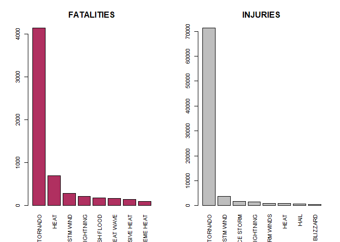
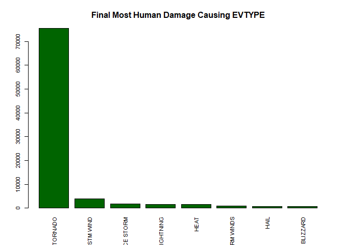
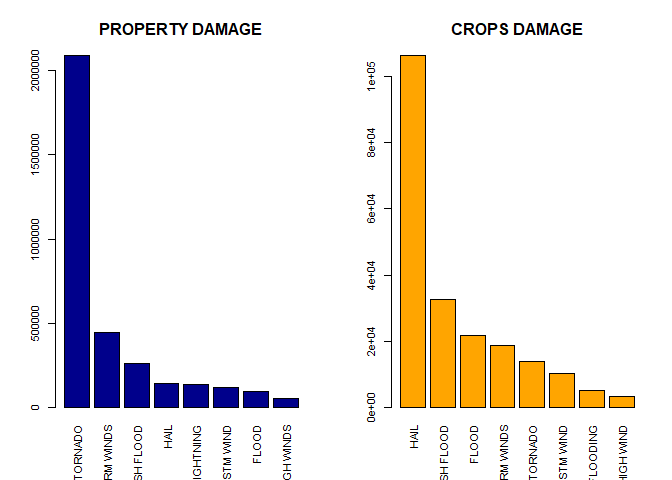
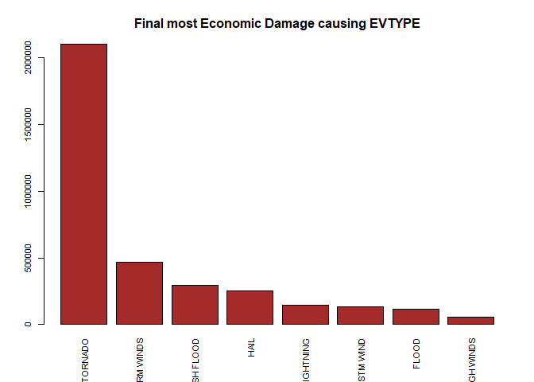

# Introduction
#### Storms and other severe weather events can cause both public health and economic problems for communities and municipalities. Many severe events can result in fatalities, injuries, and property damage, and preventing such outcomes to the extent possible is a key concern.


# Sypnosis.
#### The Goal of this Exploration of NOAA's storm Dataset is to analyze and find the answers of two basic questions : 
#### 1.Across the United States, which types of events are most harmful with respect to population health?
#### 2.Across the United States, which types of events have the greatest economic consequences?


## 1.Addressing the problem finding which type of events are most harmful for Public Health


### Checking and Processing of the data

```r
sessionInfo()
```

```
## R version 4.0.0 (2020-04-24)
## Platform: x86_64-w64-mingw32/x64 (64-bit)
## Running under: Windows 10 x64 (build 18363)
## 
## Matrix products: default
## 
## locale:
## [1] LC_COLLATE=English_India.1252  LC_CTYPE=English_India.1252   
## [3] LC_MONETARY=English_India.1252 LC_NUMERIC=C                  
## [5] LC_TIME=English_India.1252    
## 
## attached base packages:
## [1] stats     graphics  grDevices utils     datasets  methods   base     
## 
## loaded via a namespace (and not attached):
##  [1] compiler_4.0.0  magrittr_1.5    tools_4.0.0     htmltools_0.4.0
##  [5] yaml_2.2.1      Rcpp_1.0.4.6    stringi_1.4.6   rmarkdown_2.1  
##  [9] knitr_1.28      stringr_1.4.0   xfun_0.13       digest_0.6.25  
## [13] rlang_0.4.6     evaluate_0.14
```

```r
rm(list=ls())
setwd("D:/R/Class/5Reproducible Research/Assessment2")
read <- read.csv("./repdata_data_StormData.csv.bz2")
```

```
## Warning in scan(file = file, what = what, sep = sep, quote = quote, dec = dec, :
## EOF within quoted string
```

```r
names(read)
```

```
##  [1] "STATE__"    "BGN_DATE"   "BGN_TIME"   "TIME_ZONE"  "COUNTY"    
##  [6] "COUNTYNAME" "STATE"      "EVTYPE"     "BGN_RANGE"  "BGN_AZI"   
## [11] "BGN_LOCATI" "END_DATE"   "END_TIME"   "COUNTY_END" "COUNTYENDN"
## [16] "END_RANGE"  "END_AZI"    "END_LOCATI" "LENGTH"     "WIDTH"     
## [21] "F"          "MAG"        "FATALITIES" "INJURIES"   "PROPDMG"   
## [26] "PROPDMGEXP" "CROPDMG"    "CROPDMGEXP" "WFO"        "STATEOFFIC"
## [31] "ZONENAMES"  "LATITUDE"   "LONGITUDE"  "LATITUDE_E" "LONGITUDE_"
## [36] "REMARKS"    "REFNUM"
```

```r
head(read)
```

```
##   STATE__           BGN_DATE BGN_TIME TIME_ZONE COUNTY COUNTYNAME STATE  EVTYPE
## 1       1  4/18/1950 0:00:00     0130       CST     97     MOBILE    AL TORNADO
## 2       1  4/18/1950 0:00:00     0145       CST      3    BALDWIN    AL TORNADO
## 3       1  2/20/1951 0:00:00     1600       CST     57    FAYETTE    AL TORNADO
## 4       1   6/8/1951 0:00:00     0900       CST     89    MADISON    AL TORNADO
## 5       1 11/15/1951 0:00:00     1500       CST     43    CULLMAN    AL TORNADO
## 6       1 11/15/1951 0:00:00     2000       CST     77 LAUDERDALE    AL TORNADO
##   BGN_RANGE BGN_AZI BGN_LOCATI END_DATE END_TIME COUNTY_END COUNTYENDN
## 1         0                                               0         NA
## 2         0                                               0         NA
## 3         0                                               0         NA
## 4         0                                               0         NA
## 5         0                                               0         NA
## 6         0                                               0         NA
##   END_RANGE END_AZI END_LOCATI LENGTH WIDTH F MAG FATALITIES INJURIES PROPDMG
## 1         0                      14.0   100 3   0          0       15    25.0
## 2         0                       2.0   150 2   0          0        0     2.5
## 3         0                       0.1   123 2   0          0        2    25.0
## 4         0                       0.0   100 2   0          0        2     2.5
## 5         0                       0.0   150 2   0          0        2     2.5
## 6         0                       1.5   177 2   0          0        6     2.5
##   PROPDMGEXP CROPDMG CROPDMGEXP WFO STATEOFFIC ZONENAMES LATITUDE LONGITUDE
## 1          K       0                                         3040      8812
## 2          K       0                                         3042      8755
## 3          K       0                                         3340      8742
## 4          K       0                                         3458      8626
## 5          K       0                                         3412      8642
## 6          K       0                                         3450      8748
##   LATITUDE_E LONGITUDE_ REMARKS REFNUM
## 1       3051       8806              1
## 2          0          0              2
## 3          0          0              3
## 4          0          0              4
## 5          0          0              5
## 6          0          0              6
```

```r
summary(read)
```

```
##     STATE__        BGN_DATE           BGN_TIME          TIME_ZONE        
##  Min.   : 1.00   Length:281945      Length:281945      Length:281945     
##  1st Qu.:20.00   Class :character   Class :character   Class :character  
##  Median :31.00   Mode  :character   Mode  :character   Mode  :character  
##  Mean   :30.72                                                           
##  3rd Qu.:45.00                                                           
##  Max.   :78.00                                                           
##                                                                          
##      COUNTY       COUNTYNAME           STATE              EVTYPE         
##  Min.   :  0.0   Length:281945      Length:281945      Length:281945     
##  1st Qu.: 33.0   Class :character   Class :character   Class :character  
##  Median : 81.0   Mode  :character   Mode  :character   Mode  :character  
##  Mean   :101.2                                                           
##  3rd Qu.:133.0                                                           
##  Max.   :840.0                                                           
##                                                                          
##    BGN_RANGE         BGN_AZI           BGN_LOCATI          END_DATE        
##  Min.   :   0.00   Length:281945      Length:281945      Length:281945     
##  1st Qu.:   0.00   Class :character   Class :character   Class :character  
##  Median :   0.00   Mode  :character   Mode  :character   Mode  :character  
##  Mean   :   0.51                                                           
##  3rd Qu.:   0.00                                                           
##  Max.   :3749.00                                                           
##                                                                            
##    END_TIME           COUNTY_END COUNTYENDN       END_RANGE       
##  Length:281945      Min.   :0    Mode:logical   Min.   :  0.0000  
##  Class :character   1st Qu.:0    NA's:281945    1st Qu.:  0.0000  
##  Mode  :character   Median :0                   Median :  0.0000  
##                     Mean   :0                   Mean   :  0.2343  
##                     3rd Qu.:0                   3rd Qu.:  0.0000  
##                     Max.   :0                   Max.   :925.0000  
##                                                                   
##    END_AZI           END_LOCATI            LENGTH              WIDTH        
##  Length:281945      Length:281945      Min.   :   0.0000   Min.   :   0.00  
##  Class :character   Class :character   1st Qu.:   0.0000   1st Qu.:   0.00  
##  Mode  :character   Mode  :character   Median :   0.0000   Median :   0.00  
##                                        Mean   :   0.5117   Mean   :  13.72  
##                                        3rd Qu.:   0.0000   3rd Qu.:   0.00  
##                                        Max.   :2315.0000   Max.   :3330.00  
##                                                                             
##        F               MAG           FATALITIES          INJURIES        
##  Min.   :0.00     Min.   :  0.00   Min.   :  0.0000   Min.   :   0.0000  
##  1st Qu.:0.00     1st Qu.:  0.00   1st Qu.:  0.0000   1st Qu.:   0.0000  
##  Median :1.00     Median :  0.00   Median :  0.0000   Median :   0.0000  
##  Mean   :1.11     Mean   : 50.95   Mean   :  0.0247   Mean   :   0.3027  
##  3rd Qu.:2.00     3rd Qu.: 75.00   3rd Qu.:  0.0000   3rd Qu.:   0.0000  
##  Max.   :5.00     Max.   :999.00   Max.   :583.0000   Max.   :1700.0000  
##  NA's   :245086                                                          
##     PROPDMG        PROPDMGEXP           CROPDMG          CROPDMGEXP       
##  Min.   :  0.00   Length:281945      Min.   :  0.0000   Length:281945     
##  1st Qu.:  0.00   Class :character   1st Qu.:  0.0000   Class :character  
##  Median :  0.00   Mode  :character   Median :  0.0000   Mode  :character  
##  Mean   : 13.05                      Mean   :  0.8725                     
##  3rd Qu.:  0.00                      3rd Qu.:  0.0000                     
##  Max.   :900.00                      Max.   :950.0000                     
##                                                                           
##      WFO             STATEOFFIC         ZONENAMES            LATITUDE   
##  Length:281945      Length:281945      Length:281945      Min.   :   0  
##  Class :character   Class :character   Class :character   1st Qu.:2555  
##  Mode  :character   Mode  :character   Mode  :character   Median :3458  
##                                                           Mean   :2807  
##                                                           3rd Qu.:4000  
##                                                           Max.   :5273  
##                                                                         
##    LONGITUDE       LATITUDE_E     LONGITUDE_      REMARKS         
##  Min.   :    0   Min.   :   0   Min.   :    0   Length:281945     
##  1st Qu.: 6959   1st Qu.:   0   1st Qu.:    0   Class :character  
##  Median : 8819   Median :   0   Median :    0   Mode  :character  
##  Mean   : 6893   Mean   : 452   Mean   : 1114                     
##  3rd Qu.: 9643   3rd Qu.:   0   3rd Qu.:    0                     
##  Max.   :15941   Max.   :4902   Max.   :15930                     
##                                                                   
##      REFNUM      
##  Min.   :     1  
##  1st Qu.: 70487  
##  Median :140973  
##  Mean   :140973  
##  3rd Qu.:211458  
##  Max.   :283448  
##  NA's   :1
```

```r
read$EVTYPE <- as.factor(read$EVTYPE)
```


### Loading Packages

```r
 library(dplyr)
```

```
## 
## Attaching package: 'dplyr'
```

```
## The following objects are masked from 'package:stats':
## 
##     filter, lag
```

```
## The following objects are masked from 'package:base':
## 
##     intersect, setdiff, setequal, union
```

### Calculations and assigning values for Injuries and Fatalities Explicitly!

```r
forfatalities <- aggregate(FATALITIES ~ EVTYPE,read,"sum")
forfatalities <- arrange(forfatalities,desc(forfatalities[,2]))
forfatalities$EVTYPE <- as.factor(forfatalities$EVTYPE)
ff <- head(forfatalities,8)
ff$EVTYPE <- as.factor(ff$EVTYPE)
forinjuries <- aggregate(INJURIES ~ EVTYPE,read,"sum")
forinjuries <- arrange(forinjuries,desc(forinjuries[,2]))
forinjuries$EVTYPE <- as.factor(forinjuries$EVTYPE)
fi <- head(forinjuries,8)
fi$EVTYPE <- as.factor(fi$EVTYPE)
```

### Bar Plot Representation for Fatalities and Injuries Repectively.

```r
par(mfrow = c(1, 2), las = 3, cex = 0.7, cex.main = 1.4, cex.lab = 1.2)
barplot(names.arg = ff$EVTYPE , ff$FATALITIES,col= "maroon",main="FATALITIES")
barplot(names.arg = fi$EVTYPE , fi$INJURIES,col= "grey",main="INJURIES")
```

<!-- -->

### Finding the final Population/Human Damage the Events causes.
## Results : 

```r
finalhumandamage <- aggregate(read$FATALITIES+read$INJURIES , by= list(read$EVTYPE),"sum")
finalhumandamage <- arrange(finalhumandamage,desc(finalhumandamage[,2]))
fhd <- head(finalhumandamage,8)
head(fhd)
```

```
##              Group.1     x
## 1            TORNADO 75580
## 2          TSTM WIND  3943
## 3          ICE STORM  1797
## 4          LIGHTNING  1637
## 5               HEAT  1578
## 6 THUNDERSTORM WINDS   972
```

```r
par(mfrow = c(1, 1), las = 3, cex = 0.7, cex.main = 1.4, cex.lab = 1.2)
barplot(names.arg = fhd$Group.1,fhd$x,col="darkgreen",main="Final Most Human Damage Causing EVTYPE")
```

<!-- -->
## Thus, the final graph , where we have added the Injuries and Fatalities suggests that the most number of Damages are done by TORNADOs.


## 2.Addressing the problem finding greatest economic consequences.


### Damage done to the Properties and Crops.

```r
forproperties <- aggregate(read$PROPDMG,by=list(read$EVTYPE),"sum")
forproperties <- arrange(forproperties,desc(forproperties[,2]))
forproperties$Group.1 <- as.factor(forproperties$Group.1)
fp <- head(forproperties,8)

forcrops <- aggregate(read$CROPDMG,by=list(read$EVTYPE),"sum")
forcrops <- arrange(forcrops,desc(forcrops[,2]))
forcrops$Group.1 <- as.factor(forcrops$Group.1)
fc <- head(forcrops,8)
```

### Bar Plot Representation for Properties and Crops Repectively.

```r
par(mfrow = c(1, 2), las = 3, cex = 0.7, cex.main = 1.4, cex.lab = 1.2)
barplot(names.arg= fp$Group.1,fp$x,col="darkblue",main="PROPERTY DAMAGE")
barplot(names.arg= fc$Group.1,fc$x,col="orange",main="CROPS DAMAGE")
```

<!-- -->

### Final damage done to the Crops and Properties and finding the Event causing most damage.
## Results : 

```r
finaldamage <- aggregate(read$PROPDMG+read$CROPDMG,by=list(read$EVTYPE),"sum")
finaldamage <- arrange(finaldamage,desc(finaldamage[,2]))
fd <- head(finaldamage,8)
par(mfrow = c(1, 1), las = 3, cex = 0.7, cex.main = 1.4, cex.lab = 1.2)
barplot(names.arg=fd$Group.1,fd$x,col="brown",main="Final most Economic Damage causing EVTYPE")
```

<!-- -->


## Thus the final Graph suggests  that the most damages are done by the TORNADOs.


